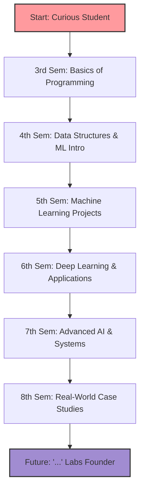

# Mr.AI ~ My Journey in Artificial Intelligence & Data Science

> “This repository is not just files... it’s a step-by-step improvement of myself.”

---

## About This Repository

Welcome to **Mr.AI**, a collection of everything I’ve built, learned, and experienced during my journey in **Artificial Intelligence and Data Science**.

From my **direct second year confusion** to **final year clarity**, this repository captures everything!

---

## Repository Structure

```
Mr.AI/
│
├── AIDS_3rd_SEM   → My Foundations begin
├── AIDS_4th_SEM   → I Exploring concepts
├── AIDS_5th_SEM   → I am Building confidence
├── AIDS_6TH_SEM   → I can build Real-world applications
├── AIDS_7th_SEM   → I can design Advanced AI systems
├── AIDS_8th_SEM   → Final evolution
│
└── README.md
```

---

## My Learning Journey



---

## A Personal Note
```bash
> It holds late nights, failed runs, debugging struggles, small wins, and big dreams.
```

Each commit is a memory.
Each folder is a chapter.

---

## Future Goals

* Build impactful AI systems
* Contribute to open-source AI
* Solve real-world problems using data
* Keep learning. Always.

---

## Final Words

> *“Started with curiosity...build...continuing with purpose.”*

---
